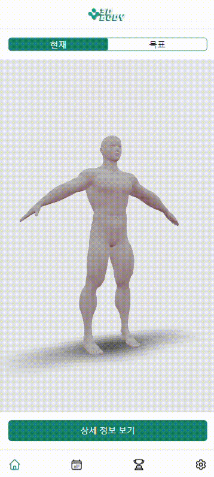
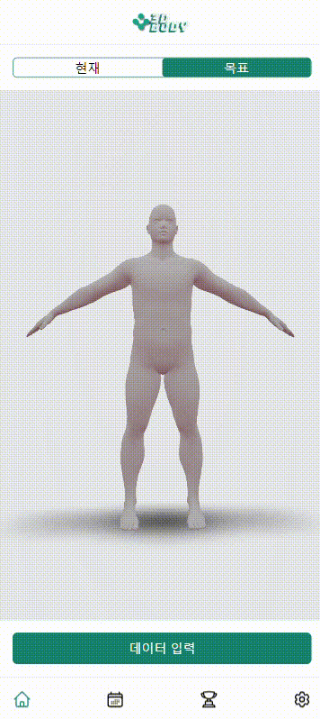
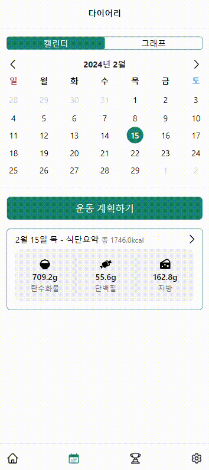
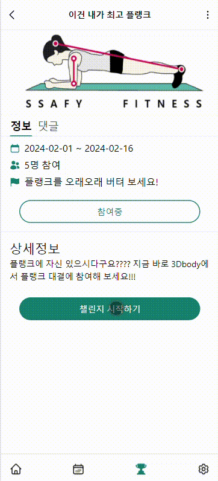

<center>
    
    <br>
    <span style="font-size:200%">3D 모델 기반 체형 관리 웹 애플리케이션</span>  
</center>

<br>
<br>

# 목차

- [팀원 소개](#팀원-소개)<br>
- [개요](#개요)<br>
- [주요 기능](#주요-기능)<br>
- [서비스 화면](#서비스-화면)<br>
- [주요 기술](#주요-기술)<br>
- [프로젝트 파일 구조](#프로젝트-파일-구조)<br>
- [프로젝트 산출물](#프로젝트-산출물)<br>

<br>
<br>

# 참여 인원

|                          이승호                          |                        김민욱                        |                            강성권                             |                          김태훈                          |                           서지원                           |                        박형규                        |
| :------------------------------------------------------: | :--------------------------------------------------: | :-----------------------------------------------------------: | :------------------------------------------------------: | :--------------------------------------------------------: | :--------------------------------------------------: |
|                      Front (Leader)                      |                        Front                         |                             Front                             |                       Back, Server                       |                            Back                            |                         Back                         |
|  |  |  |  |  |  |

<br>
<br>

# 개요

### **_Diet_** : 개인 맞춤형 운동 및 식단 관리를 통해 건강한 다이어트 실현

### **_Diary_** : 매일의 운동 및 식단 일지를 통해 진행 상황을 기록하고 분석하여 개선 방향 도출

### **_Do it_** : 목표에 따른 운동 계획 수립 및 실천으로 목표 체형 달성에 주도적으로 참여

<br>
<br>

# 주요 기능

### 3D 모델 생성

    - 개인이 제공한 데이터를 기반으로 유저의 현재 체형을 3D 모델로 생성
    - 목표 체형에 대한 데이터 입력으로 3D 모델을 생성하여 시각적으로 명확한 목표 제시

### 운동 및 식단 관리

    - 개인 맞춤형 운동 계획 제공
    - 영양학적 정보를 고려한 식단 관리 및 추천
    - 운동 및 식단 일지 기능 제공으로 진행 상황 및 성과 추적 가능

### 커뮤니티 및 동기부여

    - 다양한 챌린저를 통한 유저 간의 커뮤니티 및 오락 기능 제공
    - 목표 달성 이야기 및 성공 사례 공유를 통한 동기부여 제공

<br>
<br>

# 서비스 화면

## 모델

|  |  |
| :-----------------------------------------------: | :-------------------------------------------------: |
|               현재 인바디 기반 모델               |                 목표 모델 예측하기                  |

## 다이어리

|  |  |
| :----------------------------------------------: | :----------------------------------------------: |
|                    운동 관리                     |                    식단 관리                     |

## 챌린지

|  |  |
| :----------------------------------------------------: | :------------------------------------------------: |
|                  챌린지 조회 및 상세                   |                       웹 RTC                       |

<br>
<br>

# 주요 기술

**Backend**
<br>

&nbsp;&nbsp;&nbsp;&nbsp;&nbsp;&nbsp;

- Java : 17
- Spring Boot : 3.2.2
- Spring Data JPA : 3.2.2
- Spring Security : 3.2.2
- JWT
- QueryDSL
- IntelliJ : 2023.3.2
- Gradle : 8.5
- MySQL : 8.0.35
- Redis : 3.0.504

<br>

**3D**
<br>

&nbsp;&nbsp;&nbsp;

- Python : 3.11.7
- Flask : 3.0.2
- Blender : 2.8.1
  - MB-Lab : 1.7.8.9

<br>

**FrontEnd**
<br>

&nbsp;&nbsp;&nbsp;&nbsp;&nbsp;&nbsp;&nbsp;&nbsp;

- React 18.2.0
- Vite 5.0.8
- Vite Pwa 0.17.4
- Npm 10.2.5
- Node.js 20.10.0
- Axios 1.6.7
- React-Three/fiber 8.15.16
- Hls.js 1.5.3
- Videosdk 0.1.83
- Recoil 0.7.7
- Recoil-persist 5.1.0
- Tailwindcss 3.4.1
- Aws-sdk/client-s3 3.511.0
- Chart.js 4.4.1
- Heroicons 2.1.1

<br>

**CI/CD**
<br>

&nbsp;&nbsp;&nbsp;&nbsp;&nbsp;&nbsp;&nbsp;

- Docker : 25.0.2
- Jenkins : 2.441
- Nginx : 1.18(Ubuntu)
- AWS
  - EC2
  - RDS
  - S3

<br>

**협업 툴**
<br>

&nbsp;&nbsp;&nbsp;&nbsp;&nbsp;

- 형상 관리 : Git
- 이슈 관리 : Jira
- 커뮤니케이션 : Mattermost, Webex, Notion, Discord
- 디자인 : Figma

<br>
<br>

# 프로젝트 파일 구조

#### Backend

```
backend/src
|-- 📂main
|   |-- 📂java
|   |   └-- 📂com.ssafy.backend
|   |       |-- 📂domain
|   |       |   |-- 📂challenge
|   |       |   |-- 📂comment
|   |       |   |-- 📂food
|   |       |   |-- 📂inbody
|   |       |   |-- 📂post
|   |       |   |-- 📂routine
|   |       |   |-- 📂training
|   |       |   └-- 📂user
|   |       └-- 📂global
|   |           └-- 📂config
|   |           └-- 📂dto
|   |           └-- 📂entity
|   |           └-- 📂error
|   |           └-- 📂jwt
|   └-- 📂resources
|       └-- application.yml
└-- 📂test
```

#### Frontend

```
frontend
|-- 📂dist
└-- 📂public
|   |-- 📂3D
|   |-- 📂challenge
|   |-- 📂common
|   |-- 📂diary
|   └-- 📂loading
└-- 📂src
    |-- 📂assets
    |-- 📂components
    |   |-- 📂challenge
    |   |-- 📂common
    |   |-- 📂diary
    |   |   |-- 📂food
    |   |   |-- 📂graph
    |   |   └-- 📂training
    |   |       |-- 📂history
    |   |       └-- 📂routine
    |   |-- 📂modal
    |   |-- 📂mypage
    |   └-- 📂threedmodel
    |-- 📂pages
    |   |-- 📂auth
    |   |-- 📂challenge
    |   |   └-- 📂WebRTC
    |   |-- 📂diary
    |   |   |-- 📂food
    |   |   └-- 📂training
    |   |-- 📂home
    |   └-- 📂mypage
    |-- 📂recoil
    |   |-- 📂common
    |   |-- 📂diary
    |   └-- 📂modal
    └-- 📂router

```

<br>
<br>

# 프로젝트 산출물

- [요구사항 명세서](https://antique-scale-1a2.notion.site/69cc5f7b94b340439022beaa36675c77)
- [API 명세서](https://antique-scale-1a2.notion.site/API-54c31f40c2224a118bcf1c3dbd18ce92)
- [ERD](https://www.erdcloud.com/d/t3xtRMofbn7Nrthyk)
- [와이어프레임(피그마)](https://www.figma.com/file/XFbm01vx7fkKHHvAjCvsPl/%EC%93%B0%EB%A6%AC%EB%94%94%EB%B0%94%EB%94%94?type=design&node-id=4-2&mode=design&t=O5FMFzr8gp3KKMSj-0)
- [시스템 아키텍처](https://app.cloudcraft.co/view/1c5c2ff3-67b0-40ab-a3c0-775678b09305?key=f15dfd05-a929-455d-9e33-59becb6a5f29)
